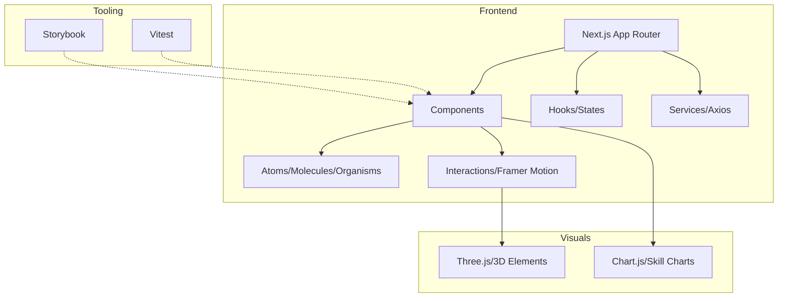

# 🌙 profile.isystk.com

[](https://circleci.com/gh/isystk/profile.isystk.com/tree/master)


## 📗 プロジェクトの概要

Next.js、Storybook、Vitest を利用して構築された、モダンなフロントエンド技術スタックによるポートフォリオサイトです。Three.js による 3D 演出や Chart.js によるスキルセットの可視化、Framer Motion を用いたアニメーションなど、インタラクティブなユーザー体験を重視して制作されています。

### 対象としている方

- Next.js (App Router) を用いたフロントエンド開発に興味がある方
- Storybook を活用したコンポーネント駆動開発の実装例を見たい方
- Vitest を使用したテスト環境の構築を参考にしたい方
- ポートフォリオサイトの制作を検討している方

### 利用している技術

#### インフラ / 実行環境
- **Docker / Docker Compose**

#### 使用しているライブラリ
- **Backend**: Next.js (App Router)
- **Frontend**: React, TypeScript, Tailwind CSS, Sass, Framer Motion, Three.js, Chart.js, react-chartjs-2, Formik, Yup, react-icons
- **Design/Tool**: Storybook, Vitest, Playwright, ESLint, Prettier, Lucide React

## 🌐 Demo


[本家サイトはこちら](https://profile.isystk.com)



## 📦 ディレクトリ構造

```text
.
├── docker/              # Docker設定ファイル
├── documents/           # 設計ドキュメント・規約
├── public/              # 静的資産（画像、APIモック等）
├── scripts/             # 運用・構築用シェルスクリプト
├── src/
│   ├── @types/          # 型定義
│   ├── app/             # Next.js App Router ページコンポーネント
│   ├── components/      # UIコンポーネント（Atomic Design）
│   ├── constants/       # 定数定義
│   ├── hooks/           # カスタムフック
│   ├── services/        # API通信等のビジネスロジック
│   ├── states/          # 状態管理
│   └── utils/           # ユーティリティ関数
├── Makefile             # 開発コマンド集
├── next.config.ts       # Next.js設定
├── tailwind.config.ts   # Tailwind CSS設定
└── vitest.config.ts     # Vitest設定
```

## 🔧 開発環境の構築

### 前提条件

* Docker / Docker Compose
* Node.js (v20以上推奨)
* npm

### セットアップ手順

1. **リポジトリのクローン**
```bash
git clone git@github.com:isystk/profile.isystk.com
cd profile.isystk.com
```

2. **環境構築**
```bash
# 環境初期化
make init
# コンテナのビルドと起動
make up
```

3. **初期設定・動作確認**
```bash
# 開発サーバーの起動
make dev
```

### Makefile の使い方

プロジェクトには開発を効率化するための `Makefile` が用意されています。

| コマンド             | 内容                                      |
|------------------|-----------------------------------------|
| `make init`      | 環境を初期化します                               |
| `make up`        | Dockerコンテナを起動します                        |
| `make down`      | Dockerコンテナを停止します                        |
| `make dev`       | 開発用サーバーを起動します (http://localhost:3000)   |
| `make storybook` | Storybookを起動します (http://localhost:6006) |
| `make test`      | Vitestによるテストを実行します                      |
| `make lint`      | ESLintによる構文チェックを実行します                   |
| `make format`    | Prettierによるコード整形を実行します                  |

## 🎧 外部ツール・サーバー

| ツール | URL | 用途 |
| --- | --- | --- |
| Storybook | http://localhost:6006 | UIコンポーネントのカタログ・開発 |
| Vitest | - | 単体テスト・コンポーネントテスト |

## 📖 ドキュメント

* [コーディング規約](./documents/react_cording_rule.md)

## 🎫 Licence

[MIT](https://github.com/isystk/profile.isystk.com/blob/master/LICENSE)

## 👀 Author

[isystk](https://github.com/isystk)
