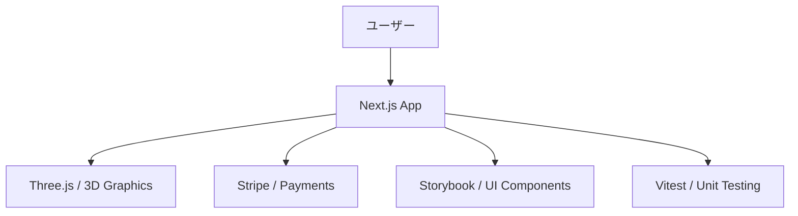

# 🌙 profile.isystk.com

[](https://circleci.com/gh/isystk/profile.isystk.com/tree/master)


## 📗 プロジェクトの概要

Next.js、Storybook、Vitest を利用して作成されたポートフォリオサイトです。最新のReactエコシステムを活用し、3Dモデリング（Three.js）や決済（Stripe）の統合、コンポーネント駆動開発を実践しています。

### 対象としている方

- Next.js を利用したモダンなフロントエンド開発に興味がある方
- Storybook を活用したコンポーネント開発手法を知りたい方
- Vitest を用いたフロントエンドのテスト構成を参考にしたい方

### 利用している技術

#### インフラ / 実行環境
- **Docker / Docker Compose**
- **Node.js**

#### 使用しているライブラリ
- **Frontend**: Next.js, React, TypeScript, Three.js, TailwindCSS, Sass, Axios, Formik, Yup
- **Design/Tool**: Storybook, Vitest, Playwright, ESLint, Prettier

## 🌐 Demo

[デモサイトはこちら](https://profile.isystk.com)



## 📦 ディレクトリ構造

```text
.
├── Makefile
├── README.md
├── docker
│   ├── app
│   └── docker-compose.yml
├── documents
│   ├── front.png
│   ├── react_cording_rule.md
│   └── storybook.png
├── eslint.config.mjs
├── next-env.d.ts
├── next.config.ts
├── package-lock.json
├── package.json
├── postcss.config.mjs
├── public
│   ├── favicon.ico
│   └── manifest.json
├── scripts
│   ├── js-ops.sh
│   └── utils.sh
├── src
│   ├── @types
│   ├── app
│   ├── assets
│   ├── components
│   ├── constants
│   ├── services
│   └── states
├── tsconfig.json
├── tsconfig.tsbuildinfo
└── vitest.config.ts
```

## 🔧 開発環境の構築

### 前提条件

* Docker / Docker Compose
* Node.js (v20以上推奨)
* npm

### セットアップ手順

1. **リポジトリのクローン**
```bash
git clone git@isystk-github.com:isystk/profile.isystk.com.git
cd profile.isystk.com
```

2. **環境構築**
```bash
# Dockerコンテナの起動とライブラリのインストール
make setup
```

3. **初期設定・動作確認**
```bash
# 開発サーバーの起動
make dev
```

### Makefile の使い方

プロジェクトの管理には Makefile を利用できます。

| コマンド | 内容 |
| --- | --- |
| `make setup` | 環境構築（Docker起動 & 依存関係インストール） |
| `make up` | コンテナの起動 |
| `make down` | コンテナの停止 |
| `make dev` | ローカル開発サーバーの起動 |
| `make build` | プロダクションビルド |
| `make storybook` | Storybookの起動 |
| `make test` | Vitestによるテスト実行 |
| `make lint` | ESLintによる構文チェック |

## 📖 ドキュメント

* [コーディング規約](./documents/react_cording_rule.md)

## 👀 Author

[isystk](https://github.com/isystk)
